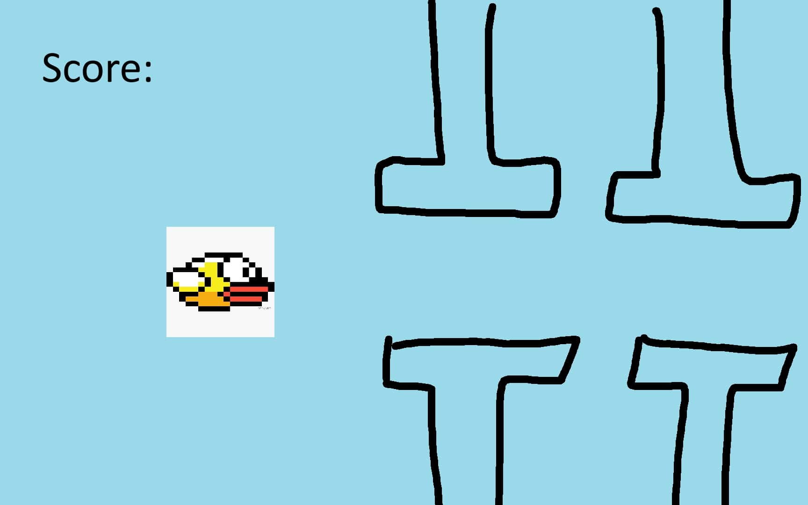
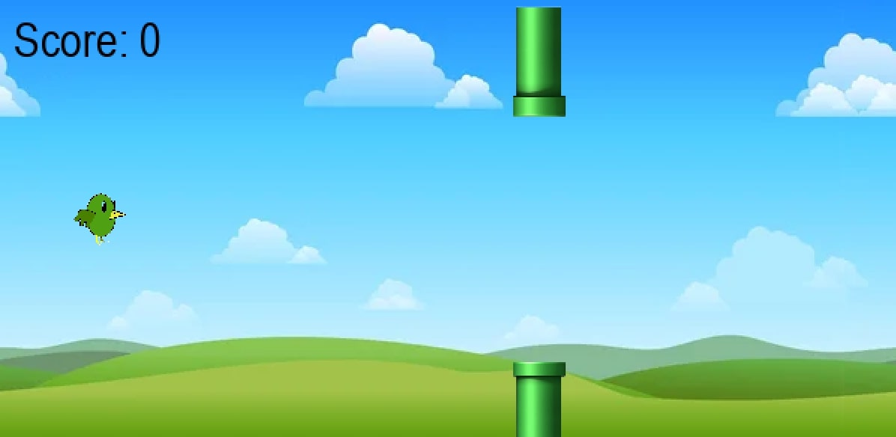

## CS110 Final Project  Fall 2024

Flappy Bird Inspo

***

## Team Members

Ivan Cheung

***

## Project Description

A simple recreation of flappy bird

***    

## GUI Design

### Initial Design

### Final Design

## Program Design

### Features

1. Moveable Character
2. Key Click Action
3. Point System
4. Object Collision
5. Moving Background

### Classes

1. bird (creates the bird object and all its functions)
2. background (creates the background and constantly moves it)
3. pipe (creates the pipe object)
4. score (creates the score object)
5. controller (the main game loop)

## ATP

| Step                 |Procedure             |Expected Results                   |
|----------------------|:--------------------:|----------------------------------:|
| 1. Run the Game | Run the main.py file | The pygame window should open and show the starting screen |
| 2. Start Game | Press space on the starting screen | The gravity should be enabled and pipes should start appearing |
| 3. Player Movement | Press once or spam the spacebar | The bird should go upwards by how much you pressed space |
| 4. Collision | Make the bird touch a pipe | The bird should be frozen and it should say Game Over, space to restart |
| 5. Points | Make the bird go through the pipes without touching | One point should be added to the score(top left) |